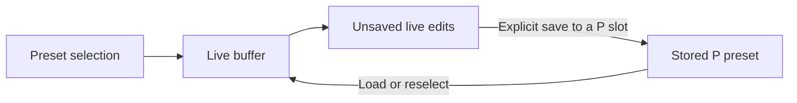

# Pocket Master Interoperability: First 30 Minutes

This is the practical on-ramp to the [Pocket Master Interoperability Reference](https://github.com/klotznick/pocket-master-interoperability-guide#readme). It walks through three bounded exercises:

1. toggle one effect and send its restoration message with standard MIDI;
2. request global settings without changing them;
3. inspect one of your own `.prst` files entirely offline.

None of these exercises saves a preset, overwrites a P bank slot, or sends a vendor-specific write.

## Before connecting

You need:

- a Sonicake Pocket Master that you own or control;
- a USB data cable;
- Python 3.10 or newer;
- a terminal;
- monitoring volume turned down;
- SONICLINK, Sonicake Manager, and other MIDI applications closed while running the exercises.

The live examples use [Mido](https://mido.readthedocs.io/en/1.3.1/installing.html) with its RtMidi port backend. The `.prst` example uses only Python's standard library and does not require the pedal.

Clone this repository:

```console
git clone https://github.com/klotznick/pocket-master-interoperability-guide.git
cd pocket-master-interoperability-guide
```

Create an isolated Python environment.

macOS or Linux:

```console
python3 -m venv .venv
source .venv/bin/activate
python -m pip install "mido[ports-rtmidi]"
```

Windows PowerShell:

```powershell
py -m venv .venv
.venv\Scripts\Activate.ps1
python -m pip install "mido[ports-rtmidi]"
```

If PowerShell refuses to activate the environment, you can run its Python directly:

```powershell
.venv\Scripts\python.exe -m pip install "mido[ports-rtmidi]"
```

## Find the correct MIDI ports

Connect the pedal by USB, then run:

```console
python examples/first_steps.py ports
```

Look for one Pocket Master input and one Pocket Master output. A backend may decorate their names, so copy the complete strings exactly as printed. Do not assume that the first port is the pedal, and do not select a virtual, network, Bluetooth, or similarly named port.

Example:

```text
MIDI inputs:
  Pocket Master

MIDI outputs:
  Pocket Master
```

If the pedal is absent from either list:

- confirm that the cable carries data, not only power;
- connect directly rather than through an uncertain hub;
- close other MIDI editors;
- disconnect and reconnect the pedal;
- rerun the command before attempting anything else.

## Exercise 1: toggle Noise Reduction and send its restoration

**Effect:** Live sound change, not a preset save.

This exercise uses the published channel-1 Noise Reduction bypass control:

```text
B0 2B 00  NR off
B0 2B 7F  NR on
```

Before running it:

1. turn monitoring volume down;
2. look at the pedal and record whether NR is currently **On** or **Bypassed**;
3. substitute the exact output name reported by the port command.

Preview the live risk category and exact target/restoration bytes first:

```console
python examples/first_steps.py toggle-nr --out "Pocket Master" --starting on --dry-run
```

Use `--starting off` instead if NR begins bypassed. Dry-run exits without loading Mido, opening a port, prompting for confirmation, or sending anything.

If NR begins on:

```console
python examples/first_steps.py toggle-nr --out "Pocket Master" --starting on
```

If NR begins bypassed:

```console
python examples/first_steps.py toggle-nr --out "Pocket Master" --starting off
```

The script prints the target and restoration bytes before sending anything. It sends only after you type `TOGGLE`, waits while you observe the pedal, and then sends the restoration message. Its `finally` block also attempts that message if you interrupt it with Ctrl-C after the first send.

Expected result:

1. NR changes once on the pedal;
2. you press Enter;
3. the restoration message is sent and you verify the original NR state on the pedal;
4. no save command is sent.

Example output when NR starts on:

```text
Target bytes:  B0 2B 00
Restore bytes: B0 2B 7F
Type TOGGLE to send the target and prepare an automatic restore: TOGGLE
Observe the NR state, then press Enter to restore it:
Restore message sent: B0 2B 7F; verify the original state on the device.
```

If the first change is not visible, stop. Do not try adjacent controller numbers. Recheck the port name, MIDI connection, and original state. If the script cannot send the restoration message because the cable or pedal disconnects, reconnect and manually return NR to the state you recorded.

## Exercise 2: send one read-only settings request

**Effect:** Device read; no setting or preset write.

The request asks for the tagged global-settings block:

```text
Logical field: 12 10
Raw SysEx:     F0 0B 09 00 01 00 00 00 02 01 02 01 00 F7
```

Preview the risk category and complete request without loading Mido or opening either port:

```console
python examples/first_steps.py read-settings \
  --in "Pocket Master" \
  --out "Pocket Master" \
  --dry-run
```

Run it with the exact input and output names from the port listing:

```console
python examples/first_steps.py read-settings \
  --in "Pocket Master" \
  --out "Pocket Master"
```

PowerShell accepts the same command on one line:

```powershell
python examples/first_steps.py read-settings --in "Pocket Master" --out "Pocket Master"
```

The script:

1. opens the input before transmitting;
2. sends the request once;
3. accepts only valid nibble-encoded SysEx frames with matching length and CRC;
4. requires command `04` fragments `00` through `03`;
5. reassembles exactly 71 logical bytes beginning `12 10`;
6. prints every tagged value, retaining raw bytes for unmapped tags.

Successful output begins:

```text
Received 4 valid fragments.
Reassembled response: 71 bytes beginning 12 10.
  0101  Firmware version             ...
  0102  Preset format version        ...
```

Values such as Master Volume and brightness reflect the connected pedal and need not match examples in the reference.

If it times out:

- verify that both exact port names are correct;
- close every other editor that may own or consume the MIDI input;
- reconnect the pedal and list the ports again;
- try one more settled request;
- do not convert the read into a write or repeatedly flood the endpoint.

A valid frame proves transport integrity. The complete four-fragment, 71-byte response with the expected `12 10` prefix is what establishes that this particular read succeeded.

## Exercise 3: inspect a `.prst` file offline

**Effect:** Passive file parsing; the pedal can remain disconnected.

Export one of your own presets to a `.prst` file using the vendor's preset-management workflow. Do not use or redistribute somebody else's preset collection.

Run:

```console
python examples/first_steps.py inspect-prst "/path/to/your-preset.prst"
```

Windows example:

```powershell
python examples/first_steps.py inspect-prst "C:\Users\you\Downloads\your-preset.prst"
```

The inspector validates:

- the exact 515-byte container size;
- the 18-byte product header;
- observed container-header version 0 or 2;
- the payload CRC-8;
- the `FFFFFFFF` saved-record slot placeholder;
- stored-preset record version 2, the only established layout interpreted here;
- the complete TLV structure;
- the ten-module, eight-parameter layout;
- an enable mask limited to known modules 0–9;
- the signal-chain permutation and expected field sizes.

It then prints the preset name and its raw bytes, level, tempo, signal chain, module states, effect IDs, and all eight float slots for each module. A name that is not valid UTF-8 is retained as raw bytes rather than declared invalid. Non-finite float values are shown with their raw four bytes and are not assigned a device meaning.

Example shape:

```text
Container:       valid, version 2, CRC ...
Preset:          ...
Preset level:    ...
Tempo:           ... BPM
Signal chain:    NR → FX1 → DRV → AMP → IR → EQ → FX2 → DLY → RVB → Clone
Modules:
   0  NR    on       effect ... params [...]
```

An error is useful evidence: do not ignore a length, header, CRC, placeholder, TLV, or layout failure. It may be a different format, a damaged file, or an unsupported version. This example deliberately reads but never modifies the file.

## Run the regression checks

The repository includes dependency-free checks for the framing, transfer, dry-run, restoration-attempt, and synthetic preset invariants used by these examples:

```console
python -m unittest discover -s tests -v
```

The tests use Python's standard library, synthetic preset data, and fake MIDI ports. They do not require Mido, connect to hardware, open a MIDI endpoint, or publish a preset.

## The state model to keep in mind



Standard MIDI changes and vendor-specific parameter writes can affect the live buffer without changing the stored preset. An acknowledgement proves that a message was accepted at some transport or operation layer; it does not, by itself, prove the current live state or persistence.

## Stop here before persistent writes

After these exercises, you have:

- selected exact MIDI endpoints rather than guessing;
- sent one documented live command and its restoration message, then verified the device state;
- completed one semantically validated read;
- parsed a complete preset file without transmitting anything.

That is enough foundation to read the full reference safely. Do not jump from these exercises to private writes by changing field IDs or payload bytes. Persistent save, copy, rename, and import workflows require destination backup, explicit confirmation, operation-specific feedback, complete semantic readback, and a tested restoration path.

Continue with:

- [Standard MIDI command reference](https://github.com/klotznick/pocket-master-interoperability-guide#standard-midi-command-reference)
- [Vendor-specific SysEx overview](https://github.com/klotznick/pocket-master-interoperability-guide#vendor-specific-sysex-overview)
- [Stored presets and `.prst` structure](https://github.com/klotznick/pocket-master-interoperability-guide#stored-presets-and-prst-structure)
- [Known limits](https://github.com/klotznick/pocket-master-interoperability-guide#known-limits)

## AI assistance

AI tools assisted with drafting, editing, and analysis. The author directed the work and validated technical claims against documented observations and hardware tests.
